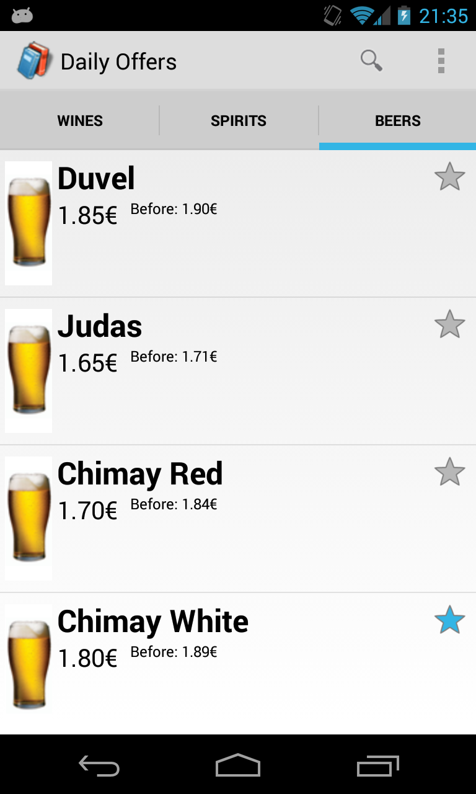
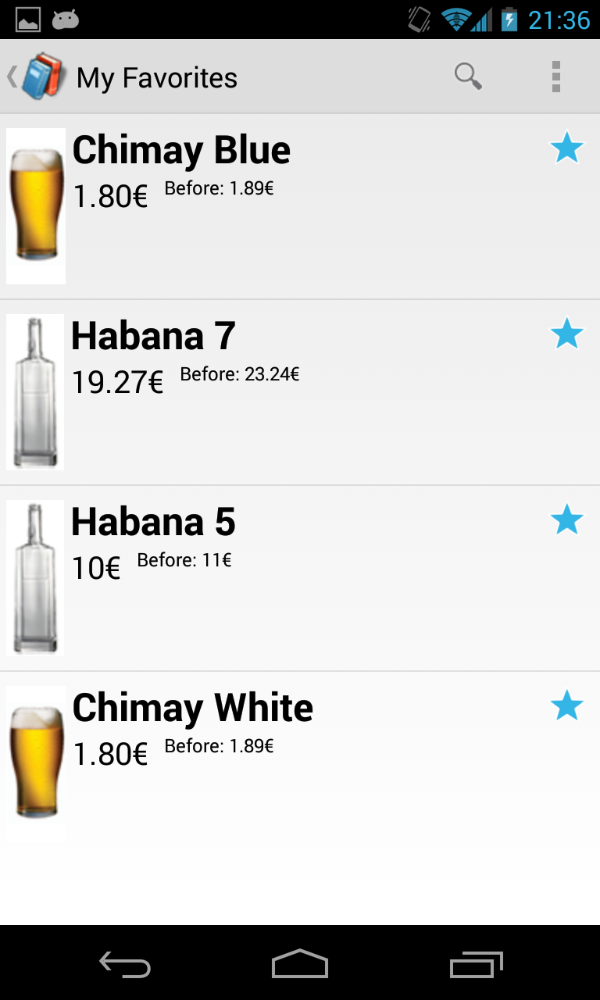
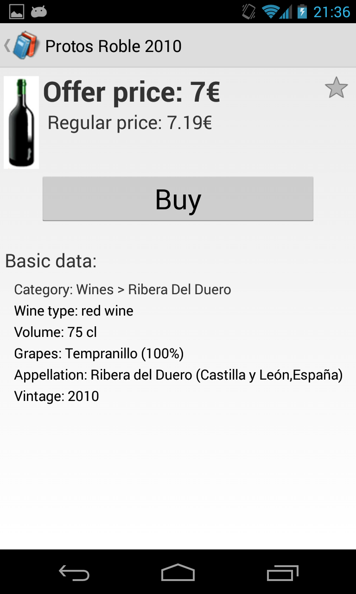
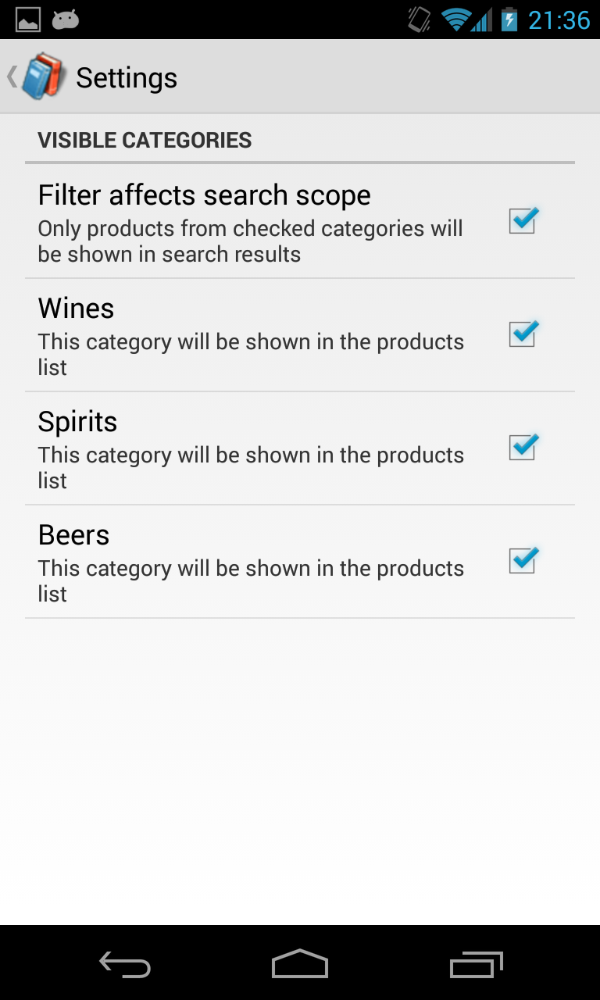

DailyOffers - Android App
===================

Project information
------------------

* Main purpose:	Learn Android concepts programming an app that meets the current Android UX
principles.
* Subject:		[Interaction and Interface Design (IDI)](http://www.fib.upc
.edu/en/estudiar-enginyeria-informatica/assignatures/IDI.html)
* School:	 	[Barcelona School of Informatics (FIB-UPC)](http://www.fib.upc.edu/)
* Course:		1013-2014 Q1
* Date:			2013-05-05
* Developer:	[Javier Ferrer Gonzalez](http://javierferrer.me)

Disclaimer
------------------

This is a project for a college subject which only evaluates the app UX, and in spite of my initial intention,
the application is not finished at this moment yet, so I decided to make it public.

Among other technical "refactor candidates", it's parsing a hardcoded JSON file inside the
application package, but I can ensure you that I can sleep :)

App screenshots
------------------

